# CRAVAB

CRAVAB is a growth-focused AI phone receptionist and operations platform for appointment-based service businesses.
It answers every inbound call, captures qualified leads, schedules jobs fast, and keeps your team aligned from first contact to completed work.

## Why teams choose CRAVAB

- Convert missed calls into booked revenue with always-on call coverage
- Deliver a premium customer experience with faster response times
- Cut admin overhead with automation across calls, clients, and appointments
- Keep operations sharp with cleaner data and real-time reporting
- Scale confidently with tenant-safe architecture and secure workflows

## Core capabilities

- AI-assisted inbound call handling and lead capture
- Appointment booking, updates, and lifecycle tracking
- Customer, service, and follow-up management
- Reporting dashboards for operational visibility
- Multi-tenant safety controls with Supabase RLS
- Vapi-powered voice workflow integration

## Progressive Web App (PWA)

CRAVAB is a full Progressive Web App (PWA), built for teams in the field and in the office.

- Installable on iPhone (iOS Safari) and Android (Chrome/Edge)
- Works beautifully on mobile and desktop with a responsive UX
- Optimized for touch workflows, quick updates, and day-to-day operations
- Reliable app-like experience for technicians, dispatchers, and managers

## Who it is for

Service businesses that run on calls and appointments: plumbing, HVAC, electrical, landscaping, cleaning, detailing, and similar field-service teams.

## Quick start

### Prerequisites

- Node.js 20+
- npm 10+
- Supabase project
- Vapi account

### 1) Clone and install

```bash
git clone <repository-url>
cd CRAVAB
npm install
```

### 2) Configure environment

Windows PowerShell:

```powershell
Copy-Item .env.example .env.local
```

macOS/Linux:

```bash
cp .env.example .env.local
```

Then update `.env.local` with your values.

Minimum required variables:

- `NEXT_PUBLIC_SUPABASE_URL`
- `NEXT_PUBLIC_SUPABASE_ANON_KEY`
- `SUPABASE_SERVICE_ROLE_KEY`
- `MASTER_ENCRYPTION_KEY`
- `NEXT_PUBLIC_APP_URL`
- `VAPI_WEBHOOK_SECRET`

### 3) Initialize database schema

Supabase SQL Editor (hosted path):

1. Run `database/schema/full_schema_supabase.sql`
2. Optional demo seed: `database/schema/05_seed_optional.sql`

CLI (`psql`) path:

```bash
psql -h <supabase-host> -U postgres -d postgres -f database/schema/00_bootstrap.sql
```

Optional seed:

```bash
psql -h <supabase-host> -U postgres -d postgres -f database/schema/05_seed_optional.sql
```

### 4) Start development server

```bash
npm run dev
```

Open `http://localhost:3000`.

### 5) Validate setup

```bash
npm run validate:env
npm run lint
npm run type-check
npm run build
```

## Daily development commands

```bash
npm run dev
npm run lint
npm run type-check
npm run build
npm run test
npm run test:coverage
npm run test:pwa
```

## Architecture at a glance

- Next.js App Router frontend and API routes
- Supabase for auth, Postgres, and row-level security
- Vapi integration for AI call tooling
- Multi-tenant isolation enforced in schema and API boundaries

## Product screenshots

Screenshots below are from the desktop (PC browser) experience.

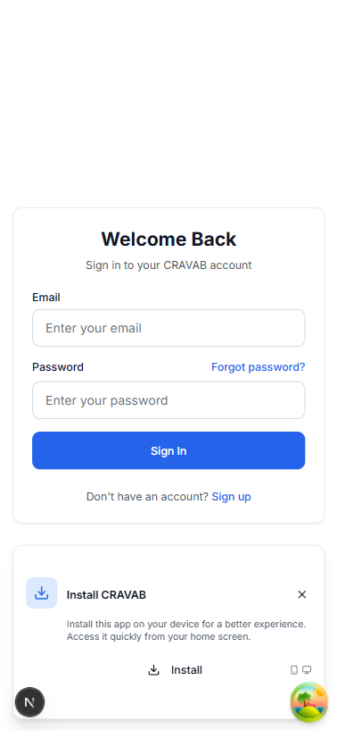
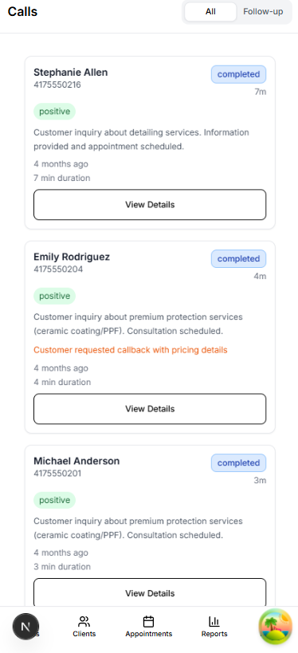
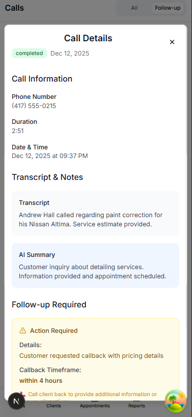
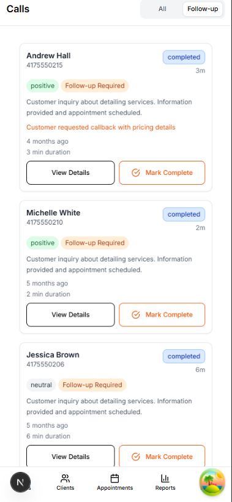
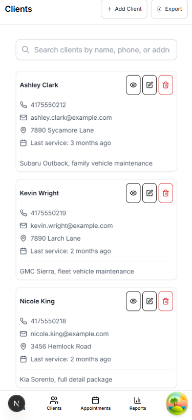
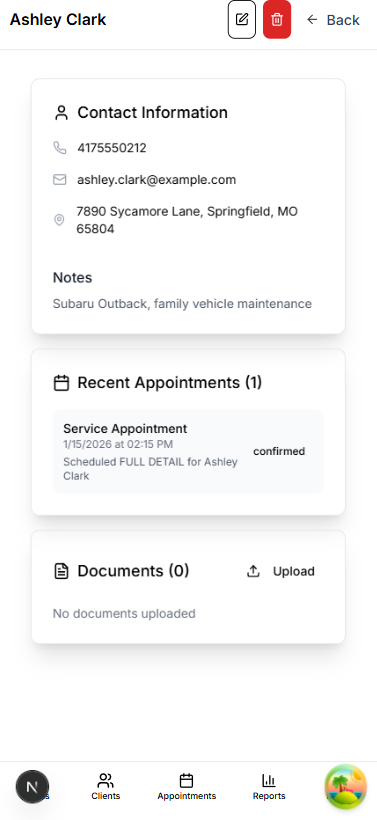
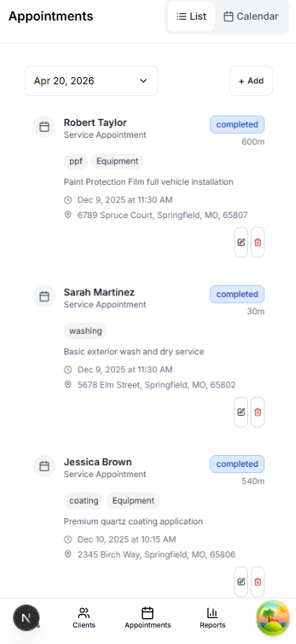
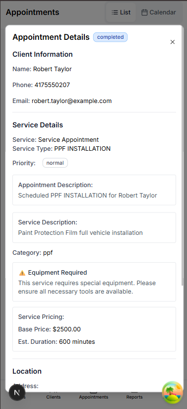
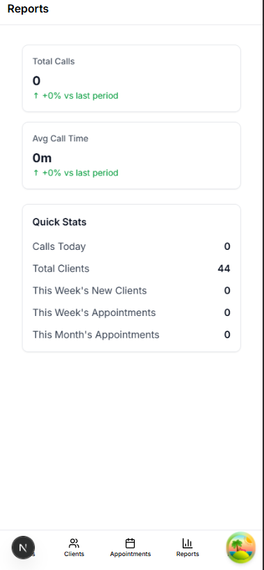
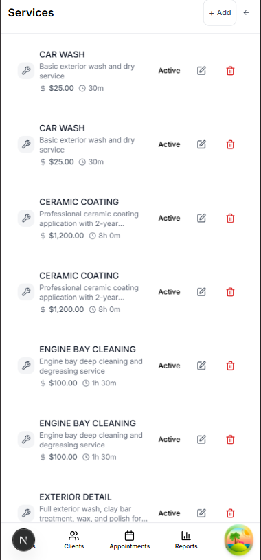
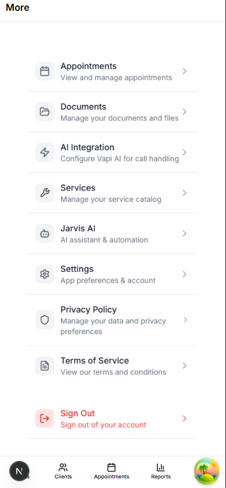
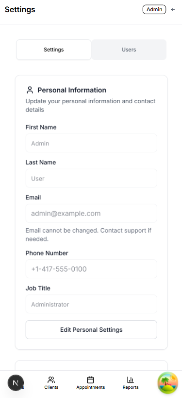
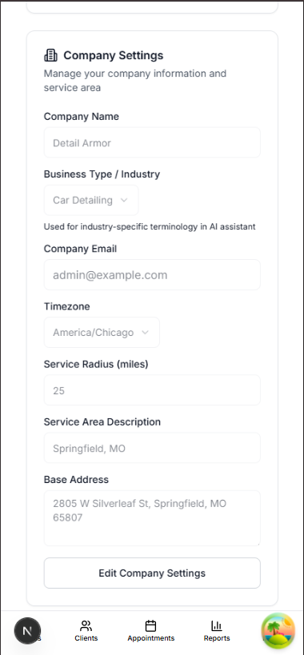

## Database modules

Canonical schema files in `database/schema/`:

- `00_bootstrap.sql`
- `01_extensions_and_types.sql`
- `02_tables_and_constraints.sql`
- `03_indexes_and_views.sql`
- `04_functions_triggers_and_rls.sql`
- `05_seed_optional.sql` (optional)

## License

This project is licensed under GNU Affero General Public License v3.0 (AGPL-3.0).

For commercial use outside AGPL-3.0 obligations, a separate paid commercial license is required.

## Documentation index

- [Setup Guide](docs/SETUP_GUIDE.md)
- [Database Guide](database/README.md)
- [Architecture](docs/ARCHITECTURE.md)
- [Vapi Integration](docs/VAPI_INTEGRATION.md)
- [Vapi Package](vapi/README.md)
- [Vapi Setup](vapi/docs/SETUP.md)
- [Supabase SQL Editor Run Order](database/schema/SUPABASE_SQL_EDITOR_RUN_ORDER.md)
- [Branch Protection](docs/BRANCH_PROTECTION.md)

## Project governance

- [Contributing](CONTRIBUTING.md)
- [Code of Conduct](CODE_OF_CONDUCT.md)
- [Security Policy](SECURITY.md)
- [Support](SUPPORT.md)