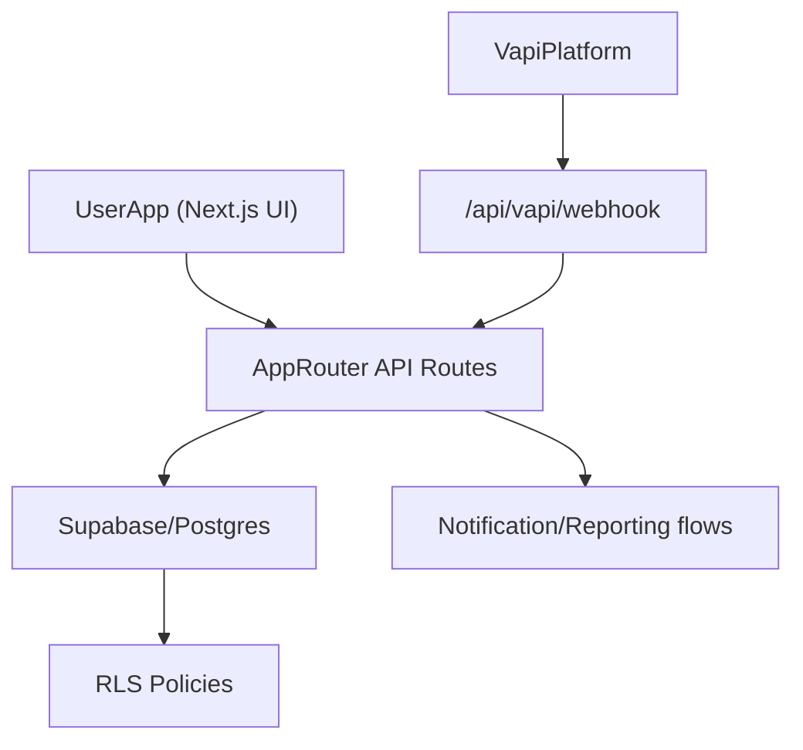

# CRAVAB Architecture

## System overview

CRAVAB is a Next.js App Router application backed by Supabase Postgres, with Vapi webhook ingestion for call workflows.

## Data flow: webhook to storage

1. Vapi sends call event payload to `/api/vapi/webhook`.
2. API route validates payload contract (`vapiWebhookSchema`).
3. Tenant resolution is derived from metadata/user linkage.
4. Calls, clients, appointments are persisted with tenant-scoped keys.
5. Query paths rely on RLS and tenant checks to enforce isolation.

## Security model

- Row-level security at database layer for tenant data.
- Server-side API enforcement via authenticated session and tenant match.
- Additional in-code guard helpers for read/write/role operations.

## Schema ownership

- `database/schema/00_bootstrap.sql`: canonical entrypoint
- `01`: extensions
- `02`: tables + constraints baseline
- `03`: indexes + views
- `04`: helper functions + RLS baseline policies
- `05`: optional non-production seed
